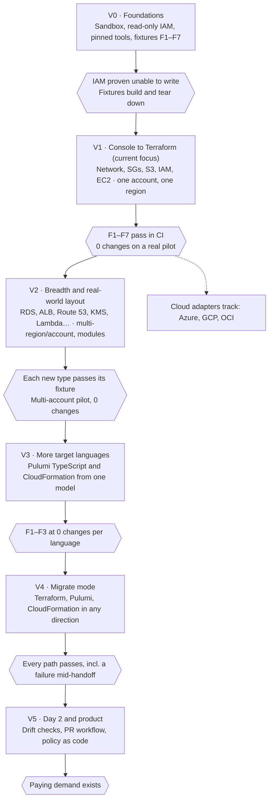
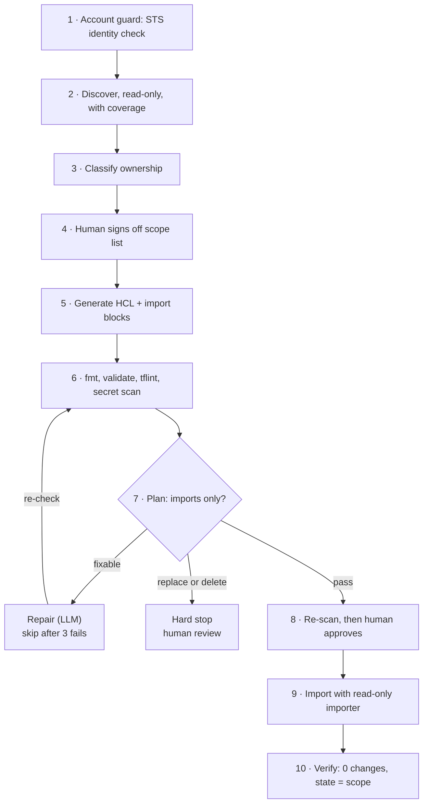

# IaC Agent: Scope & Roadmap

As of 6 Oct 2026. Source of truth for scope, gates and risks; `CLAUDE.md` is the working brief derived from it.

## Purpose and the one promise

The agent takes AWS infrastructure that a client built by hand in the console and brings it under Terraform state, with **zero changes to the running infrastructure**. Later versions add other target languages (Pulumi TypeScript, CloudFormation) and IaC-to-IaC migration.

**The one promise, which every version must keep:**

> No resource is created, updated, replaced or deleted. Proof is a `terraform plan` that shows 0 changes against live AWS, checked by Terraform itself, not by the agent.

**Who it is for:** a client who says "we built AWS in the console and want it managed by Terraform."

**What the client gets:** a Terraform repo they own, a remote state that owns their existing resources, and an adoption report listing what was adopted, what was skipped and why.

**Design principles**

- **Live AWS is the source of truth.** Never trust a template, a diagram or what the client remembers.
- **The tools decide, not the AI.** The LLM drafts and repairs code. Terraform, validators and plan JSON decide pass or fail.
- **Read-only by default.** The agent's AWS identity cannot write to AWS, even if something goes wrong.
- **Blocked beats guessed.** An unsupported or ambiguous resource is reported and skipped, never forced through.
- **A human approves every state write.**

## Coverage tiers and cloud-neutral design

Discovery sees every resource; what happens to it depends on its tier. Every tier passes the same plan gate, so wider coverage never lowers safety.

| Tier | What it covers | Promise |
| --- | --- | --- |
| **Certified** | Types on our tested list, each with a passing fixture | Supported and guaranteed: 0 changes |
| **Best-effort** | Any other type the cloud's Terraform provider can import | Adopted only if the plan shows 0 changes; otherwise skipped with the reason |
| **Excluded** | Owned by another tool, AWS-managed, default resources, already in a state | Never adopted; listed in the report |

A type moves from best-effort to certified when its fixture passes. The certified list grows each version.

**Neutral core, small cloud adapters.** About 80% of the agent is the same on every cloud: pipeline, gates, plan-JSON check, LLM repair, approvals, state handling and reports. Each cloud adds one adapter:

| Adapter part | AWS | Azure | GCP | OCI |
| --- | --- | --- | --- | --- |
| List all resources | Cloud Control API, Resource Explorer | Resource Graph | Cloud Asset Inventory | Search service |
| First-draft helper | `terraform plan -generate-config-out` | `aztfexport` | `gcloud beta resource-config bulk-export --resource-format=terraform` | OCI provider resource discovery |
| Also per cloud | Ownership rules, import ID formats, read-only role, certified fixtures | same | same | same |

Rule for the code: nothing cloud-specific lives in the core. AWS is the first adapter, not a special case.

## Roadmap at a glance



V1 is the only focus until its pilot passes; later versions start only after the previous gate is met.

## V1 scope: console to Terraform, AWS

V1 adopts hand-built resources in **one AWS account and one region per run** into a single Terraform root module. The types below are the certified tier. Other types go through the best-effort tier: adopted only at 0 changes, otherwise skipped and reported.

### In scope: resource types

| Area | Terraform resources (AWS provider 6.x) | Notes |
| --- | --- | --- |
| Network | `aws_vpc`, `aws_subnet`, `aws_internet_gateway`, `aws_nat_gateway`, `aws_eip`, `aws_route_table`, `aws_route`, `aws_route_table_association` | IPv4 only. Routes as separate `aws_route`, never inline. |
| Security groups | `aws_security_group`, `aws_vpc_security_group_ingress_rule`, `aws_vpc_security_group_egress_rule` | One rule per resource, never inline rules. Mixing styles causes endless diffs. |
| S3 | `aws_s3_bucket` + `_versioning`, `_server_side_encryption_configuration`, `_public_access_block`, `_policy`, `_lifecycle_configuration`, `_ownership_controls` | Split sub-resources only. No object contents are ever read. |
| IAM | `aws_iam_role`, `aws_iam_policy`, `aws_iam_role_policy`, `aws_iam_role_policy_attachment`, `aws_iam_instance_profile` | Customer-managed only. AWS-managed policies are referenced, never imported. |
| EC2 | `aws_instance`, `aws_ebs_volume`, `aws_volume_attachment`, `aws_key_pair` | Standalone instances only. Auto Scaling instances are excluded. |

### Out of scope for V1 (reported, not touched)

- Default VPC and its default subnets, route table, NACL and security group
- Anything owned by another tool: CloudFormation stacks (`aws:cloudformation:*` tags), Elastic Beanstalk, EKS, Auto Scaling groups, Service Catalog
- Service-created resources: Lambda/ELB/EKS network interfaces, service-linked roles (`/aws-service-role/` path)
- Resources already in another Terraform state (checked against state files the client provides)
- IPv6, Transit Gateway, VPC peering, NACLs, VPC endpoints, RDS, load balancers, Lambda, KMS, Route 53 (all V2)
- Multi-region and multi-account runs (V2)

### Inputs from the client

1. A read-only IAM role in their account (policy supplied by us, see Safety)
2. Account ID, region and an optional tag or VPC filter to limit scope
3. An S3 bucket for remote state (or permission for us to create one in a separate, approved step)
4. A list of existing Terraform state locations, if any, so nothing is double-owned
5. An agreed **change freeze window** for the resources in scope
6. Sign-off on the **scope list** before any import

### Deliverable

```text
client-infra/
  versions.tf        # pinned Terraform + AWS provider
  providers.tf
  backend.tf         # S3 remote state, encrypted, versioned, locked
  network.tf
  security_groups.tf
  s3.tf
  iam.tf
  ec2.tf
  imports.tf         # import blocks, kept for audit then removed
  README.md          # how to plan and change safely from now on
  ADOPTION_REPORT.md # adopted / skipped / why, with resource IDs
  FINDINGS.md        # security scan results, reported, NOT auto-fixed
```

### V1 acceptance criteria

V1 is done only when all of these are true on the test fixtures and one real pilot account:

1. `terraform plan -detailed-exitcode` returns **0** after import.
2. `terraform plan -refresh-only` shows no changes.
3. Every resource on the signed-off scope list is in state **exactly once**; nothing outside it is in state.
4. Every discovered resource is in the report as adopted or skipped, with a reason. Zero unexplained gaps.
5. Code passes `terraform fmt -check`, `terraform validate` and `tflint` with no errors.
6. No hardcoded resource IDs where a reference is possible (e.g. `vpc_id = aws_vpc.main.id`).
7. A second full run on the same account produces the same code and still 0 changes (idempotent).
8. No AWS write API was called during the run (verified in CloudTrail).

## Pipeline and gates



Steps 4 and 8 are human approvals. A plan with any replace or delete stops the run; nothing is fixed by changing infrastructure.

| Step | Gate (deterministic) | On failure |
| --- | --- | --- |
| 1 Account guard | STS account and region equal the signed-off values | Stop before any read |
| 2 Discover | Every type complete: no AccessDenied, full pagination, retries within budget | Type marked incomplete; run blocks |
| 3 Classify | Each resource is ours, other tool, AWS-managed, default, or already in state | Only "ours" continue; the rest go to the report |
| 4 Scope sign-off | Human approves the exact resource ID list | No generation without it |
| 5 Generate | Fixed import ID format per type; references instead of hardcoded IDs | Resource skipped and reported |
| 6 Static checks | `fmt -check`, `validate`, `tflint`, gitleaks all clean | Repair loop |
| 7 Plan gate | Plan JSON: every action `no-op`, only imports | Fixable diff: repair. Replace or delete: hard stop |
| 8 Approve | Re-scan fingerprint unchanged; human approves plan | Changed infra: back to step 2 |
| 9 Import | Apply with importer identity, state locked, backup first | Re-run (idempotent) or restore state |
| 10 Verify | `plan -detailed-exitcode` = 0, refresh-only clean, state list = scope list | Run fails; report shows the gap |

## What can go wrong: failure modes register

Every failure below has a deterministic detection and a defined response. If a row's detection fires, the run stops or the resource is skipped. It never continues on the agent's say-so.

### Discovery failures

| Failure | How we detect it | Control |
| --- | --- | --- |
| Missing read permission hides resources | Every API call's error is recorded; AccessDenied marks that type as **incomplete** | Report coverage per type. An incomplete type blocks the run until fixed or explicitly excluded. |
| Pagination stops early | Paginate to the end of every list call; count checked against a second call where the API supports it | A truncated list marks the type incomplete. |
| API throttling | Retries with backoff; retry budget per call | Budget exhausted = type incomplete, never silently partial. |
| Resource owned by another tool (CFN, ASG, EKS, Beanstalk) | Ownership tags, `AutoScalingGroupName`, CFN `DescribeStackResource`, service-linked paths | Classified **not ours**, excluded and reported. |
| Resource already in another Terraform state | Compare IDs against client-provided state files | Excluded. Double ownership is a hard stop. |
| Default VPC / default resources picked up | `IsDefault` flag and default-resource markers | Excluded in V1. |
| Infra changes between scan and import | Fingerprint of every in-scope resource, re-scanned right before import | Any change = rescan and regenerate. Change freeze agreed with client. |

### Code generation failures

| Failure | How we detect it | Control |
| --- | --- | --- |
| Invalid HCL or unknown attributes (LLM hallucination) | `terraform validate` against the pinned provider schema | Repair loop, max 3 attempts, then skip resource and report. |
| Wrong import ID format | Import plan errors | ID format per resource type is fixed in code, not chosen by the LLM. |
| Hardcoded IDs instead of references | Static check: any ID in code that matches a resource in state | Rewritten to a reference; fails the gate if left. |
| Inline vs separate rules mixed (SG rules, routes, IAM policies) | Lint rule in our gate | One style only, enforced. Mixed style fails. |
| Provider defaults or computed fields cause diffs (`tags_all`, default encryption, etc.) | Plan JSON shows `update` actions | Repair loop sets the real value; no `ignore_changes` to hide it. |
| Attribute forces replacement (AMI, AZ, CIDR, name) | Plan JSON shows `replace` or `delete` | **Hard stop.** Never repaired by changing infra. Human review. |
| Secret values land in code (EC2 user_data, policies with keys) | Secret scanner (gitleaks) on generated code | Flagged; value moved to a variable or skipped. Never committed. |
| Name collisions in resource addresses | Address uniqueness check | Deterministic naming: Name tag, else type + ID suffix. |
| Prompt injection via tags or descriptions | Tags and descriptions are passed as quoted data only | LLM has no tool to run commands or touch AWS; gates are code. |

### Import and state failures

| Failure | How we detect it | Control |
| --- | --- | --- |
| Plan shows any create/update/replace/delete | Plan JSON: every `resource_changes[].change.actions` must be `no-op` (import only) | Hard gate. Nothing proceeds. |
| Import partially applied (crash mid-apply) | State list compared with scope list | Re-run is safe: import is idempotent; missing items are retried, extra items removed with `removed` blocks. |
| Two people run apply at once | State locking on the backend | Second run fails to acquire the lock. |
| State file lost or corrupted | S3 versioning + backup taken before every write | Restore previous version. Infra is unaffected. |
| State contains sensitive values | Known for user_data, policies, etc. | State bucket encrypted (SSE-KMS), private, versioned, access logged. |
| Someone edits infra in console after adoption | Scheduled `plan` (drift check) | Reported to client; out of V1, built in V5. |

### Agent and process failures

| Failure | How we detect it | Control |
| --- | --- | --- |
| Agent logic is wrong but claims success | Success is defined only by gates (plan exit code, state vs scope, coverage) | The agent's report is never the proof. |
| Repair loop never converges | Attempt counter | Max 3 per resource, then skip and report. |
| Accidental real apply with changes | AWS identity is read-only; plan gate before apply | Even if gates fail, AWS rejects writes. |
| Wrong account or region | STS `GetCallerIdentity` vs signed-off account ID | Mismatch = hard stop before any read. |
| Tool version drift changes behaviour | Exact pins for Terraform, AWS provider, tflint, checkov | Versions recorded in the report; upgrades go through the test suite. |
| LLM outage or cost runaway | Timeouts and per-run token budget | Run pauses with a resumable checkpoint. |

## Safety rules, permissions and rollback

Adoption writes only to Terraform state, never to AWS. The permission model makes that true even if every other control fails.

### Two identities, both unable to change AWS

| Identity | AWS access | Other access | Used for |
| --- | --- | --- | --- |
| **Scanner** | Read-only: `Describe*`, `List*`, `Get*` on config APIs for in-scope services | None | Discovery, plan |
| **Importer** | Same read-only AWS access | Write to the state bucket and key only | `terraform apply` of import blocks |

Both carry an **explicit deny** on everything outside their read list, including data and secret reads: `s3:GetObject` (outside the state bucket), `secretsmanager:GetSecretValue`, `ssm:GetParameter*`, `kms:Decrypt` (outside the state key). We do not use the broad AWS `ReadOnlyAccess` policy because it can read object contents. See `iam/`.

If a bad plan ever reached apply, AWS would refuse the write. That is the backstop behind the plan gate.

### Hard rules

1. No `terraform apply` unless plan JSON contains **only** imports with `no-op` actions.
2. No `ignore_changes`, no `-target` tricks, no `-replace`, no edits to infra to make a diff go away.
3. Security findings are **reported, not fixed**. Fixing them changes infra, which breaks the promise. They become a separate, client-approved change after adoption.
4. A human approves the scope list before generation and the final plan before import.
5. The run executes inside the client's account or their CI. Credentials never leave their boundary; short-lived role sessions only.
6. The LLM receives resource configuration metadata only, never credentials, secret values or object contents. It has no shell and no AWS tool.
7. Every run records: tool versions, scope list, plan JSON, gate results, approver and timestamps.

### Rollback

Because AWS is never changed, rollback is a state operation only.

- **Before import:** nothing to roll back. Delete the generated code.
- **After import:** restore the previous state version from S3 versioning, or remove the new state. The resources keep running untouched and simply return to unmanaged.
- **Partial import:** re-run (imports are idempotent), or drop the extra entries with `removed` blocks (`lifecycle { destroy = false }`), which forget them without deleting.

Rollback never means `terraform destroy`. That command is blocked in the agent entirely.

## Test strategy and fixtures

No version ships until it passes on fixtures in a dedicated sandbox AWS account and then on one real pilot account.

### Fixtures: fake clients

Fixture infra is created with **AWS CLI or boto3 scripts, never Terraform**, so it truly looks hand-built. Each fixture has a manifest listing every resource ID it creates and whether the agent should adopt or exclude it.

| Fixture | What it contains | Expected result |
| --- | --- | --- |
| F1 minimal | 1 VPC, 2 subnets, IGW, route table | All adopted, 0 changes |
| F2 typical web stack | VPC, public + private subnets, NAT, EIP, SGs with rules, IAM role + instance profile, EC2 with extra EBS, S3 bucket with versioning, encryption, policy, lifecycle | All adopted, 0 changes |
| F3 edge configs | Many tags, odd tag characters, SG self-references and SG-to-SG rules, inline + managed IAM policies, bucket with no encryption set explicitly | All adopted, 0 changes |
| F4 must be excluded | CloudFormation stack resources, ASG instance, default VPC, service-linked role | All excluded, reasons in report |
| F5 permissions gap | Scanner role missing one service's read permission | Run blocks with coverage marked incomplete |
| F6 drift mid-run | Script changes a tag between scan and import | Detected, run restarts, no stale import |
| F7 forced replacement | Code mutated to a different AZ on purpose | Plan gate stops with `replace`, no apply |

### What is checked on every test run

1. All gates in the pipeline pass or fail exactly as the fixture manifest expects.
2. State list equals the manifest's adopt list. Nothing more, nothing less.
3. CloudTrail for the run window shows zero AWS write calls.
4. A second run is idempotent: same code, 0 changes.
5. Golden files: generated code for F1 and F2 compared with a reviewed snapshot; unexpected diffs fail the build.

### Hygiene

- Fixtures are torn down after each run by the same scripts; a tag on every fixture resource makes leftovers easy to find.
- The sandbox account has a budget alarm.
- Tests run in CI on every change to the agent and nightly against the sandbox.

## V2 to V5 detail

Each version keeps every V1 gate and adds its own. A version starts only when the previous one has passed on a real pilot.

### V2: breadth and real-world layout

- **More resource types**, each with its own fixture before it is enabled: NACLs, VPC endpoints, VPC peering, RDS (instances, subnet groups, parameter groups), ALB/NLB with target groups and listeners, ACM, Route 53 zones and records, KMS keys and aliases, Lambda, CloudWatch log groups, ECR, ECS.
- **Write-only secrets** (e.g. RDS master password): never read back; adopted with a variable and lifecycle note, flagged in the report.
- **Multi-region and multi-account** runs via assumed roles, one state per account/region/environment.
- **Layout refactor:** move from flat files to modules and environments using `moved` blocks, still proven by 0 changes.
- **OpenTofu** as an alternative engine, same gates.
- **Exit gate:** every new type passes its fixture; one multi-account pilot at 0 changes.

### V3: other target languages

- **Pulumi TypeScript** output: adopt with Pulumi import; gate = `pulumi preview` shows 0 changes.
- **CloudFormation** output: adopt with a CloudFormation `IMPORT` change set; only resource types that CloudFormation supports for import are allowed, others are reported.
- One shared resource model feeds every output, so adding a language never touches discovery.
- **Exit gate:** F1 to F3 pass at 0 changes for each target language.

### V4: migrate mode (one IaC tool to another)

- Terraform → Pulumi TS, CloudFormation → Terraform, Pulumi → Terraform, Terraform → CloudFormation.
- Old code and state are read for names, structure and intent. **Live AWS is still the source of truth.**
- **Ownership handoff protocol, in this order:**
  1. New tool imports and proves 0 changes.
  2. Human approves the handoff.
  3. Old tool releases without deleting: `removed` blocks in Terraform, `DeletionPolicy: Retain` then stack removal in CloudFormation, `pulumi state delete` in Pulumi.
  4. Old tool shows the resources gone from its state; AWS shows them still running.
- A resource is never owned by two tools at the same time, and never by none longer than the handoff window.
- **Exit gate:** each migration path passes fixtures, including a forced failure mid-handoff that recovers cleanly.

### V5: day 2 and product

- Scheduled drift detection with reports to the client.
- Pull-request workflow in the client's CI: every infra change goes through plan review.
- Policy as code on plans (e.g. block public buckets, IAM wildcards) for future changes.
- A service, dashboard and multi-tenant auth **only when paying demand exists**. The earlier branch built these first; we build them last.

### Cloud adapters: Azure, GCP, OCI (track after the V1 pilot)

Each cloud is one adapter on the neutral core: discovery, ownership rules, import ID formats, read-only role and its own certified fixtures. This track starts once AWS passes its pilot and can run alongside V2.

## Open decisions

Each has a recommended default; confirm or change before V0 closes.

| Decision | Recommended default | Why |
| --- | --- | --- |
| Engine: Terraform or OpenTofu | Terraform (pinned, see `tools.lock.json`), OpenTofu in V2 | Most clients ask for Terraform by name; 1.7+ supports `for_each` imports and `removed` blocks |
| Which LLM | Claude via Amazon Bedrock in the client's region | Data stays in their AWS account, which eases client security review |
| Where the agent runs | Inside the client's account or CI | Credentials never leave the client |
| Code layout in V1 | Flat files per service in one root module | Simplest to review; modules come in V2 via `moved` blocks |
| Default VPC | Excluded in V1 | `aws_default_*` resources behave differently; adopt later on request |
| Draft generation | Terraform's own config generation for the first draft, LLM to clean up and repair | Uses the provider's real schema; the LLM improves readability |
| Naming convention | `<type>_<Name tag>`, else `<type>_<short id>` | Stable across runs, readable |
| Repo visibility | Private until V1 pilot passes | Avoid publishing an unproven safety claim |

Progress is tracked in the shared roadmap doc and in `CLAUDE.md` ("Current status" and "Next tasks").
