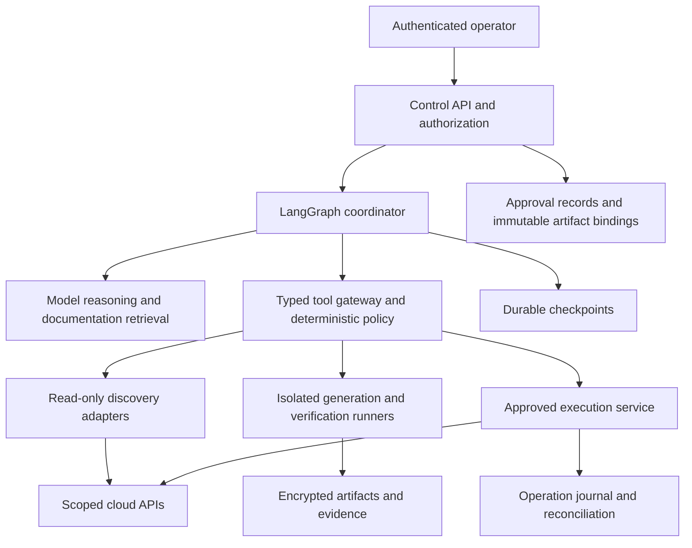

# Infrastructure migration architecture

Status: production-oriented design with a local assessment foundation implemented. The first destination is Pulumi TypeScript on AWS. Manual adoption and CloudFormation migration share discovery and verification infrastructure but use separate ownership-transfer procedures. Terraform, Azure, GCP, Bicep, and cross-cloud relocation remain extension targets.

## Product behavior

An operator selects cloud accounts, regions, source framework, destination, resource scope, and operational constraints. The system reports discovery coverage, assesses dependencies and ownership, proposes migration batches, prepares target artifacts, and waits for authenticated approval before any external changes. Completion requires resource identity and configuration checks, unambiguous ownership, a clean explained destination preview, application health checks, and retained evidence.

The system must assess the deployed environment as well as source code. A template can be stale, incomplete, or inconsistent with live infrastructure. No universal inventory source establishes complete discovery: supplement inventory services with service APIs, pagination, configuration reads, and explicit coverage tracking. Missing permissions, disabled regions, unsupported types, and unresolved references are blockers for affected batches. Configuring an inventory service may create roles or indexes and needs a separate approved setup action.

## Services and trust boundaries

The graph does not hold cloud credentials. The credential broker issues short-lived credentials to authorized tools after scope checks. The model cannot mint approvals, edit policy, access checkpoint storage, call arbitrary shell commands, or invoke cloud mutations directly. Tool responses and model proposals remain untrusted until typed validation and semantic checks pass.

The proposed production stack is Python LangGraph, PostgreSQL for checkpoints and operational records, encrypted object storage for artifacts, isolated disposable runners, and a deterministic policy service. Use customer-managed deployment and model endpoints where residency requirements demand them. Endpoint selection and retention must be explicit customer configuration; provider branding is not a security control.

## Graph responsibilities

The implemented graph is `assess -> review interrupt -> reviewed blocked or rejected`. The authenticated facade collects fixture inventory through the tool gateway before starting the graph. Review resumes after checkpoint restoration and only acknowledges the exact assessment.

The target graph adds discovery, normalization, dependency analysis, documentation retrieval, migration planning, target generation, validation, bounded repair, approval, drift recheck, execution, verification, and reconciliation subgraphs. These are specialized responsibilities within one product. The coordinator can schedule independent read-only tasks within budgets. External writes are serialized within each locked migration scope.

Production state references tenant and run identities, source commit, inventory and artifact hashes, adapter versions, policy version, plan and destination-state digests, approval IDs, operation IDs, evidence references, and status. Store secret references rather than values. Use authenticated APIs for start, read, resume, cancel, and export. Arbitrary LangGraph state updates, replay, or time travel must never grant execution authority.

## Approval and policy enforcement

An execution approval binds the authenticated approver and role, tenant, cloud account and regions, action class, resource list, source commit, code tree hash, inventory snapshot, configuration comparison, plan, provider and tool versions, policy version, destination stack and state digest, expiry, and unique nonce. Persist approvals transactionally and consume each action authorization once. Changed input requires revalidation and new approval. Fresh approvals cannot overwrite unresolved operations.

Production ownership transfer requires a reviewer distinct from the requester and executor service. Enforce organizational role policy server-side. A chat reply, model-generated token, or `Command(resume=True)` is not sufficient authorization. Approval review and execution are separate graph nodes; resume payloads contain approval references rather than privileged policy fields.

Default migration policy allows adoption only. Block unexpected create, update, replace, or delete operations. Block IAM expansion, encryption changes, public exposure, protection removal, out-of-scope resources, and unexplained configuration differences. Any intended remediation is a separate change request. Resource adapters must document computed defaults, read-only properties, provider differences, and irrecoverable secret inputs instead of suppressing drift.

## Resource adapters and canonical infrastructure model

Normalize resources into a versioned canonical model containing identity, scope, ownership, configuration with secret references, dependencies, provenance, observation time, discovery coverage, and source-code correspondence. Framework adapters translate this model into destination code and management operations. Retain source-specific semantics; a lossy common representation cannot prove parity.

Every adapter declares discovery coverage, property mappings, import lookup rules, provider version, unsupported features, replacement hazards, ownership-transfer stages, verification checks, and tested recovery. Current VPC, subnet, security-group, and bucket mappings are metadata candidates only. They do not represent complete configurations or qualified adoption support.

The first live qualification campaign should use small manual VPC and subnet fixtures, then a CloudFormation-managed equivalent. Add IAM, encryption keys, data stores, nested stacks, custom resources, and service-managed infrastructure only after their own acceptance campaigns. Cross-cloud relocation requires a separate design for data movement, cutover, and service equivalence.

## External operation recovery

Before a write, commit an operation intent and acquire a fenced scope lock. Record attempt identity and request binding. After submission, capture tool and provider receipts. A timeout or crash with uncertain completion becomes `OUTCOME_UNKNOWN`. Read destination state and cloud configuration before classifying it as succeeded, failed without effect, partially applied, or requiring operator intervention. Never automatically replay an unknown operation.

LangGraph can re-enter nodes during resume. Durable graph state is not an exactly-once transaction with a cloud provider. Combine tasks with the operation journal, provider idempotency where available, and deterministic reconciliation. Fencing controls coordinator races; they do not cancel a request already accepted by a provider. The emergency stop blocks new operations and tracks in-flight work.

## Observability and operations

Track inventory coverage, unresolved dependencies, blocked mappings, validation failures, approval wait, API throttling, operation uncertainty, drift, repair iterations, model and tool budgets, and application health. Set operational targets after measuring representative workloads. Enforce bounded pagination, deadlines, output sizes, and fan-out; persist partial coverage on exhaustion.

Use redacted structured events with tenant, run, plan, and operation references. Restrict access to traces and artifacts, encrypt storage, configure retention and deletion, and test backup restoration. Record code and tool versions for every acceptance run. Do not record secrets or hidden reasoning. A preview with no diff does not establish application health or complete configuration parity.

## Official references

- [LangGraph persistence](https://docs.langchain.com/oss/python/langgraph/persistence) supports durable state; production storage and authorization remain application responsibilities.
- [LangGraph interrupts](https://docs.langchain.com/oss/python/langgraph/interrupts) documents pause/resume and node replay.
- [Pulumi adoption](https://www.pulumi.com/docs/iac/guides/migration/import/) documents CLI and program-first imports and stack state changes.
- [CloudFormation migration](https://www.pulumi.com/docs/iac/guides/migration/migrating-to-pulumi/from-cloudformation/) explains resource retention and import; translation is not universally automatic.
- [AWS discovery coverage](https://docs.aws.amazon.com/resource-explorer/latest/userguide/supported-resource-types.html) documents resource and permission limitations.

These references support tool behavior. The service architecture and controls above are design decisions, not claims that providers implement them for this application.
