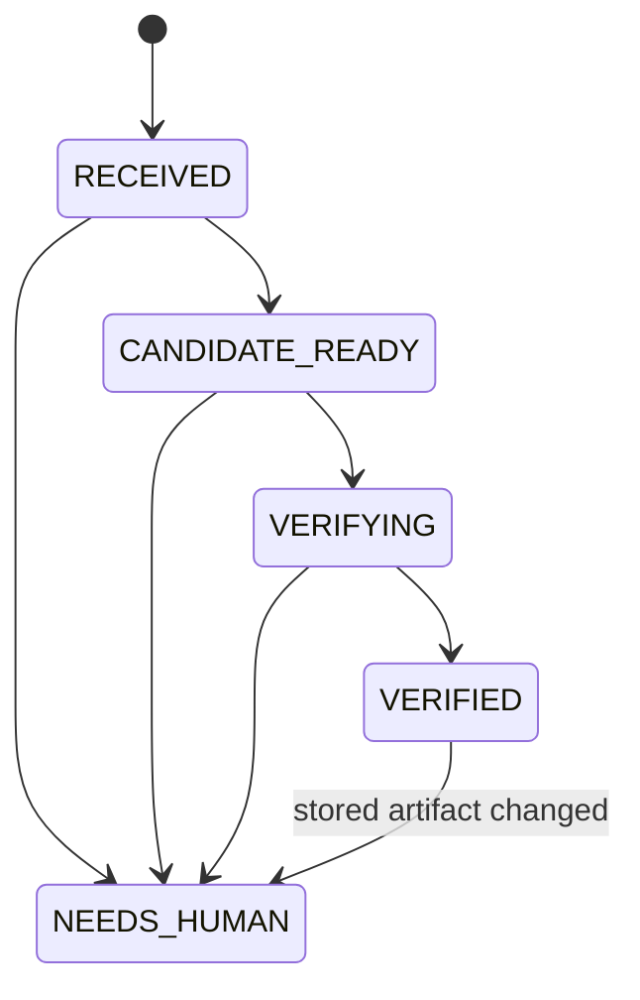

# ADR 0002: PostgreSQL control plane for synthetic workflow recovery

- Status: Implemented as a local Phase 1C experiment
- Date: 2026-09-27
- Scope: Synthetic candidate only; no Jira or GitHub writes

## Decision

PostgreSQL owns workflow state. A saved Agents API session ID provides task context, and the downloaded artifact provides candidate bytes, but neither may declare a candidate verified. A trusted controller stores an immutable policy snapshot, commits a content-addressed candidate reference, reconstructs the exact tree on recovery, invokes the Phase 1B verifier through an interface, and commits a verification tied to that candidate before moving to `VERIFIED`.

The initial state machine is deliberately narrow:

Application code requests transitions; PostgreSQL rejects illegal transitions. Candidate, verification, policy, and event records are append-only. Composite foreign keys bind a verification to a run, candidate, archive SHA-256, tree SHA-256, and base commit. A database trigger requires the linked verification status to be `PASS` before `VERIFIED`. State changes and their events share a transaction.

An advisory lock limits a run to one recovery worker at a time and is automatically released when a worker dies. Verification itself is outside the state transaction because it runs candidate code in a separate restricted Docker container. A crash after `VERIFYING` but before result commit permits safe verification rerun; no publication action occurs in this phase. Repeated resume after `VERIFIED` rechecks the content-addressed artifact and returns the stored result without rerunning verification. An integrity failure moves the run to `NEEDS_HUMAN` while preserving the historical result.

The operation ledger has a unique idempotency key, immutable kind and payload hash, and one-way `PLANNED -> SUCCEEDED` or `PLANNED -> OUTCOME_UNKNOWN` transitions. Phase 1C allows only a local `synthetic_notice` record. Future external adapters must reconcile `OUTCOME_UNKNOWN` read-only before any retry; this experiment does not implement those adapters.

## Evidence and limits

The [Phase 1C recovery result](../experiments/control-plane/PHASE-1C-RESULTS.md) records a real process interruption after candidate creation and a fresh-process PostgreSQL recovery that reaches one linked `PASS` verification. The original input copy was removed before recovery. A repeated resume preserved the same IDs and counts, while altered stored bytes failed closed.

The artifact store is local and integrity-checked, not replicated. The test PostgreSQL cluster is disposable, with a private Unix socket and no TCP listener. Operational hardening, real Jira/GitHub adapters, review/publication gates, and multi-host execution remain outside this decision and require separate qualification.
